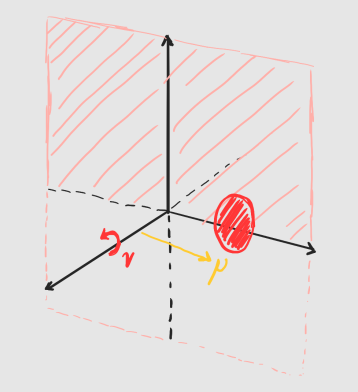
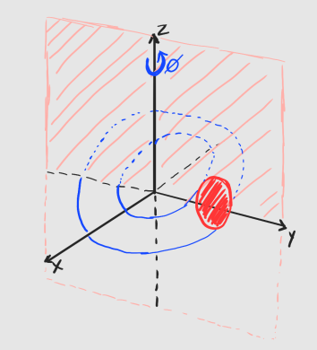
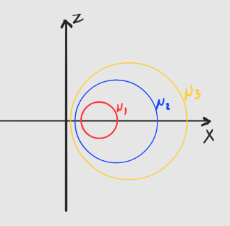
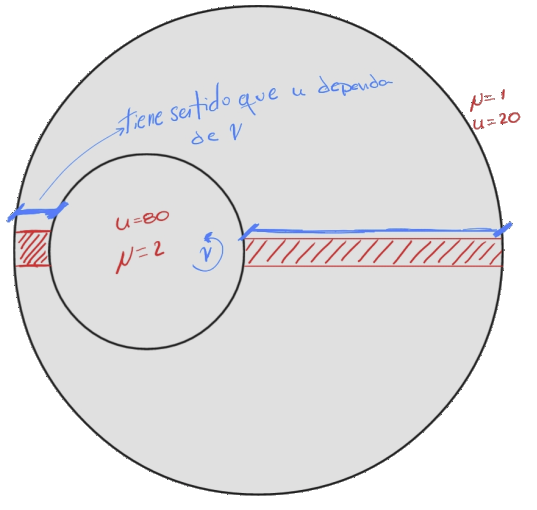

<style>
  /* Justificar todo el texto de los párrafos */
  p {
      text-align: justify;
  }
</style>

## Definición del Problema

Dadas las coordenadas toroidales $q_1 = \mu$, $q_2 = \nu$, $q_3 = \phi$, cuyas transformaciones a coordenadas cartesianas se definen como:

$$x = \frac{a \sinh \mu \cos \phi}{\cosh \mu - \cos \nu}$$
$$y = \frac{a \sinh \mu \sin \phi}{\cosh \mu - \cos \nu}$$
$$z = \frac{a \sin \nu}{\cosh \mu - \cos \nu}$$

donde $a$ es una constante real positiva, $\mu \in [0, \infty)$, $\nu \in (-\pi, \pi]$ y $\phi \in [0, 2\pi)$. 
Considere la región $\Omega$ dada por: $1 \le \mu \le 2$, $-\pi < \nu \le \pi$, $0 \le \phi < 2\pi$. Tomando el parámetro $a=1$:

a. Describir y graficar la región $\Omega$.
b. Calcular el volumen de $\Omega$.
c. Escribir el Laplaciano $\nabla^2u$ en coordenadas toroidales.
d. Resolver el problema de valores de contorno para la conducción de calor estacionaria si $u = u(\mu)$, con $\nabla^2 u = 0$ en $\Omega$, $u=20$ para $\mu=1$ y $u=80$ para $\mu=2$.

---

## (a) Descripción y Gráfica de la Región $\Omega$

En el sistema de coordenadas toroidales, el parámetro $a$ representa el radio de un "anillo focal" base. La variable $\mu$ define el grosor de un toroide (a mayor $\mu$, más estrecho el "tubo"), mientras que $\nu$ y $\phi$ son ángulos que barren la superficie.

El completo barrido de $\nu$ genera una circunferencia en el plano XY, mientras que el barrido de $\phi$ genera la revolución alrededor del eje Z, generando un toroide. Luego, $\mu$ define la posición radial del toroide: $\mu=1$ corresponde a un toroide más grueso, y $\mu=2$ a uno más delgado anidado dentro del primero.

Las siguientes figuras muestran un esquema de la representación de las coordenadas toroidales:  

::: {#fig-ejes layout-ncol=3}






Visualización de los tres ejes del sistema.
:::


En la figura 1 se puede observar la región $\Omega$ como el volumen comprendido entre los toroides definidos por $\mu=1$ (verde) y $\mu=2$ (rojo). La figura 2 muestra un corte transversal ($\phi \in [0, \pi)$) donde se puede apreciar claramente la cavidad interior del toroide más delgado ($\mu=2$) dentro del toroide más grueso ($\mu=1$).

### Región $\Omega$

```{python}
#| label: fig-toros-completos
#| fig-cap: "Región Ω: Volumen comprendido entre los toroides μ=1 y μ=2."
import numpy as np
import plotly.graph_objects as go

a = 1.0
nu = np.linspace(-np.pi, np.pi, 80)
phi = np.linspace(0, 2 * np.pi, 80)
NU, PHI = np.meshgrid(nu, phi)

def toroidales_a_cartesianas(mu, nu, phi, a=1.0):
    D = np.cosh(mu) - np.cos(nu) + 1e-9
    x = (a * np.sinh(mu) * np.cos(phi)) / D
    y = (a * np.sinh(mu) * np.sin(phi)) / D
    z = (a * np.sin(nu)) / D
    return x, y, z

X_ext, Y_ext, Z_ext = toroidales_a_cartesianas(1.0, NU, PHI, a)
X_int, Y_int, Z_int = toroidales_a_cartesianas(2.0, NU, PHI, a)

fig1 = go.Figure()
fig1.add_trace(go.Surface(x=X_ext, y=Y_ext, z=Z_ext, colorscale='Greens', opacity=0.5, showscale=False, name='μ=1'))
fig1.add_trace(go.Surface(x=X_int, y=Y_int, z=Z_int, colorscale='Reds', opacity=0.9, showscale=False, name='μ=2'))

fig1.update_layout(scene=dict(aspectmode='data'), margin=dict(l=0, r=0, b=0, t=0), height=500)
fig1.show()
```

### Visualización con Corte Transversal

```{python}
#| label: fig-toros-corte-transversal
#| fig-cap: "Corte transversal de la región Ω."
phi_corte = np.linspace(0, np.pi, 60)
NU_C, PHI_C = np.meshgrid(nu, phi_corte)

Xc_ext, Yc_ext, Zc_ext = toroidales_a_cartesianas(1.0, NU_C, PHI_C, a)
Xc_int, Yc_int, Zc_int = toroidales_a_cartesianas(2.0, NU_C, PHI_C, a)

fig2 = go.Figure()
fig2.add_trace(go.Surface(x=Xc_ext, y=Yc_ext, z=Zc_ext, colorscale='Greens', opacity=0.5, showscale=False, name='μ=1'))
fig2.add_trace(go.Surface(x=Xc_int, y=Yc_int, z=Zc_int, colorscale='Reds', opacity=0.9, showscale=False, name='μ=2'))

fig2.update_layout(scene=dict(aspectmode='data'), margin=dict(l=0, r=0, b=0, t=0), height=500)
fig2.show()
```

Si hacemos un corte horizontal con $\nu \in [0, \pi)$ se observa cómo esta coordenada barre la circunferencia del toroide.

### Corte Horizontal (ν)

```{python}
#| label: fig-toros-corte-horizontal
#| fig-cap: "Corte horizontal de la región Ω."
nu_corte = np.linspace(0, np.pi, 60)
NU_C, PHI_C = np.meshgrid(nu_corte, phi_corte)

Xc_ext_nu, Yc_ext_nu, Zc_ext_nu = toroidales_a_cartesianas(1.0, NU_C, PHI_C, a)
Xc_int_nu, Yc_int_nu, Zc_int_nu = toroidales_a_cartesianas(2.0, NU_C, PHI_C, a)

fig3 = go.Figure()
fig3.add_trace(go.Surface(x=Xc_ext_nu, y=Yc_ext_nu, z=Zc_ext_nu, colorscale='Greens', opacity=0.5, showscale=False, name='μ=1'))
fig3.add_trace(go.Surface(x=Xc_int_nu, y=Yc_int_nu, z=Zc_int_nu, colorscale='Reds', opacity=0.9, showscale=False, name='μ=2'))

fig3.update_layout(scene=dict(aspectmode='data'), margin=dict(l=0, r=0, b=0, t=0), height=500)
fig3.show()
```

---

## (b) Cálculo del Volumen

Para calcular el volumen de la región, necesitamos conocer cómo se deforma un cubo un coordenadas cartesianas al transformarse a coordenadas toroidales. Esto se logra a través del Jacobiano de la transformación, que nos da el factor de escala necesario para convertir un diferencial de volumen en coordenadas cartesianas a uno en coordenadas toroidales.  

De esta forma el diferencial de volumen estará dada por:  
$$dV = h_1 h_2 h_3 d\mu d\nu d\phi$$

siendo $h_i=\left\| \frac{\partial \mathbf{r}}{\partial q_i} \right\|$ los factores de escala correspondientes a cada coordenada.

Para simplificar la anotación, definimos $D(\mu, \nu) = \cosh \mu - \cos \nu$. Este será un término que aparecerá muchas veces en las distintas expresiones. Cuando sea necesario, se escribirá la expresión completa.

#### Deducción del factor de escala $h_\phi$

Derivamos las ecuaciones de transformación respecto a la coordenada $\phi$:
$$ {\color{red}\frac{\partial x}{\partial \phi} = -\frac{a \sinh \mu \sin \phi}{D(\mu, \nu)}}, \quad\quad
    {\color{blue}\frac{\partial y}{\partial \phi} = \frac{a \sinh \mu \cos \phi}{D(\mu, \nu)}}, \quad\quad
      {\color{green}\frac{\partial z}{\partial \phi} = 0}$$

Elevando al cuadrado y sumando, aplicamos la identidad $\sin^2 \phi + \cos^2 \phi = 1$:
$$h_\phi = \sqrt{ \frac{a^2 \sinh^2 \mu \sin^2 \phi}{D(\mu, \nu)^2} + \frac{a^2 \sinh^2 \mu \cos^2 \phi}{D(\mu, \nu)^2}}$$

$$h_\phi = \sqrt{ \frac{a^2 \sinh^2 \mu (\sin^2 \phi + \cos^2 \phi)}{D(\mu, \nu)^2} }$$

$${\color{orange}\boxed{h_\phi = \frac{a \sinh \mu}{D(\mu, \nu)}}}$$


#### Deducción del factor de escala $h_\nu$

De forma análoga, derivamos respecto a $\nu$, notando que la derivada del denominador es $\frac{\partial D(\mu, \nu)}{\partial \nu} = \sin \nu$. Aplicando la regla del cociente:
$$ {\color{red}\frac{\partial x}{\partial \nu} = -\frac{a \sinh \mu \cos \phi \sin \nu}{D(\mu, \nu)^2}}, \quad\quad
    {\color{blue}\frac{\partial y}{\partial \nu} = -\frac{a \sinh \mu \sin \phi \sin \nu}{D(\mu, \nu)^2}}, \quad\quad
      {\color{green}\frac{\partial z}{\partial \nu} = \frac{a(\cos \nu \cosh \mu - 1)}{D(\mu, \nu)^2}}$$

Sumando los cuadrados de las tres componentes:
$$h_\nu^2 = \frac{a^2 \sinh^2 \mu \sin^2 \nu (\cos^2 \phi + \sin^2 \phi) + a^2(\cos \nu \cosh \mu - 1)^2}{D(\mu, \nu)^4}$$

$$h_\nu^2 = \frac{a^2 \sinh^2 \mu \sin^2 \nu + a^2(\cos \nu \cosh \mu - 1)^2}{D(\mu, \nu)^4}$$

$$h_\nu^2 = \frac{a^2}{D(\mu, \nu)^4} [\sinh^2 \mu \sin^2 \nu + (\cos \nu \cosh \mu - 1)^2]$$

$$h_\nu^2 = \frac{a^2}{D(\mu, \nu)^4} [\sinh^2 \mu \sin^2 \nu + \cos^2 \nu \cosh^2 \mu - 2\cos \nu \cosh \mu + 1]$$

Con la identidad hiperbólica $\sinh^2 \mu = \cosh^2 \mu - 1$:

$$h_\nu^2 = \frac{a^2}{D(\mu, \nu)^4} [(\cosh^2 \mu - 1) \sin^2 \nu + \cos^2 \nu \cosh^2 \mu - 2\cos \nu \cosh \mu + 1]$$

$$h_\nu^2 = \frac{a^2}{D(\mu, \nu)^4} [\cosh^2 \mu \sin^2 \nu - \sin^2 \nu + \cos^2 \nu \cosh^2 \mu - 2\cos \nu \cosh \mu + 1]$$

$$h_\nu^2 = \frac{a^2}{D(\mu, \nu)^4} [\cosh^2 \mu (\sin^2 \nu + \cos^2 \nu) - \sin^2 \nu - 2\cos \nu \cosh \mu + 1]$$

$$h_\nu^2 = \frac{a^2}{D(\mu, \nu)^4} [\cosh^2 \mu - \sin^2 \nu - 2\cos \nu \cosh \mu + 1]$$

$$h_\nu^2 = \frac{a^2}{D(\mu, \nu)^4} [\cosh^2 \mu - 2\cos \nu \cosh \mu + \cos^2 \nu]$$

Y finalmente, el término entre corchetes es el trinomio cuadrado perfecto $(\cosh \mu - \cos \nu)^2 = D(\mu, \nu)^2$:  

$$h_\nu^2 = \frac{a^2}{D(\mu, \nu)^4} [D(\mu, \nu)^2]$$

$${\color{orange}\boxed{h_\nu = \frac{a}{D(\mu, \nu)}}}$$


#### Deducción del factor de escala $h_\mu$

El procedimiento para derivar respecto a $\mu$ es simétrico al anterior. Aplicando la regla del cociente y la identidad hiperbólica $\cosh^2 \mu - \sinh^2 \mu = 1$, el trinomio resultante vuelve a colapsar en $D(\mu, \nu)^2$, obteniendo:

$${\color{orange}\boxed{h_\mu = \frac{a}{D(\mu, \nu)}}}$$


#### Cálculo del Volumen

Ahora sí, el diferencial de volumen es $dV = h_\mu h_\nu h_\phi \, d\mu \, d\nu \, d\phi$. Planteando la integral triple sobre $\Omega$ con $a=1$:

$$V = \int_{0}^{2\pi} \int_{-\pi}^{\pi} \int_{1}^{2} \frac{1}{D(\mu, \nu)} \frac{1}{D(\mu, \nu)} \frac{\sinh \mu}{D(\mu, \nu)} \, d\mu \, d\nu \, d\phi$$

$$V = \int_{0}^{2\pi} \int_{-\pi}^{\pi} \int_{1}^{2} \frac{\sinh \mu}{D(\mu, \nu)^3} \, d\mu \, d\nu \, d\phi$$

$$V = \int_{0}^{2\pi} \int_{-\pi}^{\pi} \int_{1}^{2} \frac{\sinh \mu}{(\cosh \mu - \cos \nu)^3} \, d\mu \, d\nu \, d\phi$$

El integrando no depende de $\phi$, entonces:

$$\boxed{V = 2\pi \int_{-\pi}^{\pi} \int_{1}^{2} \frac{\sinh \mu}{(\cosh \mu - \cos \nu)^3} \, d\mu \, d\nu}$$

Resolvemos con Python utilizando `scipy.integrate.nquad` para obtener el valor numérico del volumen:

```{python}
import numpy as np
from scipy.integrate import nquad

def integrando(mu, nu):
    return np.sinh(mu) / (np.cosh(mu) - np.cos(nu))**3

# Límites de integración para mu y nu (no depende de phi)
limites = [
    [1, 2],                 # Límites para mu
    [-np.pi, np.pi],        # Límites para nu
]

# Calcular la integral
volumen, error = nquad(integrando, limites)

volumen = 2 * np.pi * volumen  # Integración sobre phi

print(f"Volumen calculado: {volumen:.5f}")
print(f"Error estimado: {error:.2e}")
```

$$\boxed{V = 2\pi^2 \left( \frac{\cosh 1}{\sinh^3 1} - \frac{\cosh 2}{\sinh^3 2} \right) \approx 17,2150}$$

*Nota: No se establecieron unidades para el trabajo.*

---

## (c) Operador Laplaciano

Utilizando la definición general del Laplaciano para coordenadas ortogonales y sustituyendo nuestros factores de escala, obtenemos:

$$\nabla^2 \psi (q_1,q_2,q_3) = \frac{1}{q_1q_2q_3} \left( \frac{\partial}{\partial q_1} \left( \frac{h_2h_3}{h_1} \frac{\partial \psi}{\partial q_1} \right) + \frac{\partial}{\partial q_2} \left( \frac{h_1h_3}{h_2} \frac{\partial \psi}{\partial q_2} \right) + \frac{\partial}{\partial q_3} \left( \frac{h_1h_2}{h_3} \frac{\partial \psi}{\partial q_3} \right) \right)$$

$$\nabla^2 \psi = \frac{D(\mu, \nu)^3}{\sinh \mu} \left[ \frac{\partial}{\partial \mu} \left( \frac{\sinh \mu}{D(\mu, \nu)} \frac{\partial \psi}{\partial \mu} \right) + \frac{\partial}{\partial \nu} \left( \frac{\sinh \mu}{D(\mu, \nu)} \frac{\partial \psi}{\partial \nu} \right) + \frac{\partial}{\partial \phi} \left( \frac{1}{D(\mu, \nu) \sinh \mu} \frac{\partial \psi}{\partial \phi} \right) \right]$$


---

## (d) Problema de Conducción de Calor

Mediante la expresión del Laplaciano y considerando que $u=u(\mu)$, es decir, que las derivadas parciales respecto a $\nu$ y $\phi$ serán nulas:

$$\nabla^2 u = \frac{D(\mu, \nu)^3}{\sinh \mu} \frac{\partial}{\partial \mu} \left( \frac{\sinh \mu}{D(\mu, \nu)} \frac{du}{d\mu} \right) = 0$$

Para que esta expresión sea $0$, vemos primero el término de la izquierda de la derivada parcial, $\frac{D(\mu, \nu)^3}{\sinh \mu}$. Para la region establecida con las restricciones $1 \le \mu \le 2$, $-\pi \lt \nu \le \pi$, el denomidador nunca podrá ser $0$ y el numerador para que sea $0$ se debería cumplir que $\cosh \mu = \cos \nu$. Siendo el valor máximo de $\cos \nu$ es igual a $1$ y el valor mínimo de $\cosh \mu$ es aproximadamente igual a $1,54$. De esta forma este término no podrá ser $0$.  

Esto implica que $\frac{\partial}{\partial \mu} \left( \frac{\sinh \mu}{D(\mu, \nu)} \frac{du}{d\mu} \right) = 0$, y para que esto ocurra $\frac{\sinh \mu}{D(\mu, \nu)} \frac{du}{d\mu} = C$, siendo $C$ una constante.

Analizando en más detalle esta expresión, implicaría lo siguiente:

$$\frac{du}{d\mu} = C \frac{\cosh \mu - \cos \nu}{\sinh \mu}$$

Pero la condición inicial establece que $u$ es función únicamente de $\mu$, lo que implica que el lado derecho de la ecuación no puede depender de $\nu$. Sin embargo, el término $\cos \nu$ introduce una dependencia explícita de $\nu$, lo que genera una contradicción.

La única forma de resolver esta contradicción es que el término $C$ sea igual a $0$, lo que implica que $\frac{du}{d\mu} = 0$. Esto a su vez implica que $u$ es una constante, lo cual no puede ser cierto dado que las condiciones de contorno establecen valores diferentes para $u$ en $\mu=1$ y $\mu=2$.

{fig-align="center"}

Podríamos considerar que $\frac{du}{d\mu} = C$ que, integrando 2 veces:  

$$u(\mu) = C_1\mu + C_2$$

Con las condiciones de contorno dadas $u(1) = 20$ y $u(2) = 80$, nos queda el simple sistema de ecuaciones:

$$20 = C_1 \cdot 1 + C_2$$
$$80 = C_1 \cdot 2 + C_2$$

Resolviendo el sistema, obtenemos $C_1 = 60$ y $C_2 = -40$, lo que nos da la solución final:

$$\boxed{u(\mu) = 60\mu - 40}$$


Esto implica que la distribución de calor entre $\mu=1$ y $\mu=2$ es lineal, y un corte transversal a la dirección de revolución (plano XZ) muestra ls distribución de temperatura.

```{python}
#| label: fig-calor-2d
#| fig-cap: "Distribución de temperatura en el conductor."
import matplotlib.pyplot as plt

mu_grid = np.linspace(1, 2, 150)
nu_grid = np.linspace(-np.pi, np.pi, 150)
MU_G, NU_G = np.meshgrid(mu_grid, nu_grid)

D_g = np.cosh(MU_G) - np.cos(NU_G)
X_g = (1.0 * np.sinh(MU_G)) / D_g
Z_g = (1.0 * np.sin(NU_G)) / D_g
U_g = 60 * MU_G - 40

fig, ax = plt.subplots(figsize=(8, 6))
mapa_calor = ax.contourf(X_g, Z_g, U_g, levels=50, cmap='inferno')
ax.contour(X_g, Z_g, U_g, levels=10, colors='white', linewidths=0.5, alpha=0.5)

cbar = plt.colorbar(mapa_calor, ax=ax)
cbar.set_label('Temperatura u(μ)', rotation=270, labelpad=20)

ax.set_aspect('equal')
ax.set_title('Corte Transversal 2D del Flujo de Calor (Plano XZ)')
ax.set_xlabel('Eje X')
ax.set_ylabel('Eje Z')
plt.show()
```